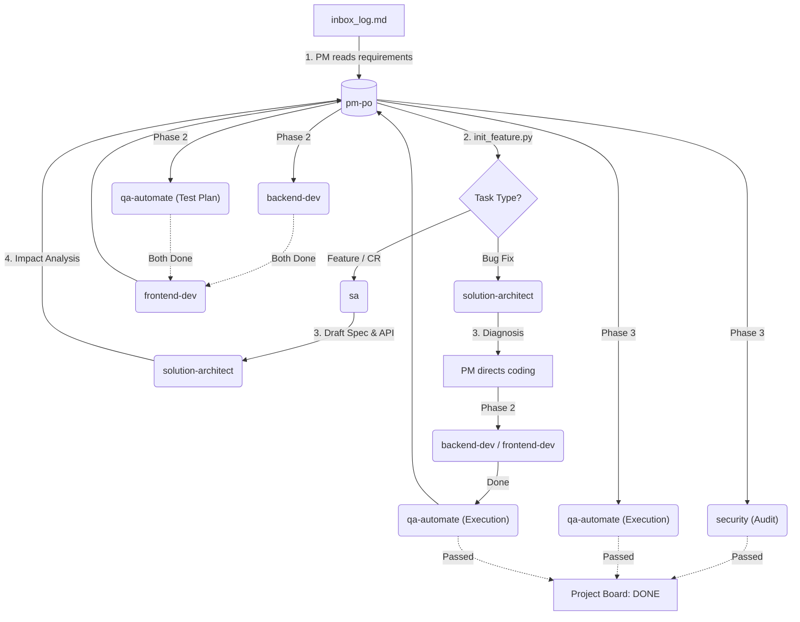
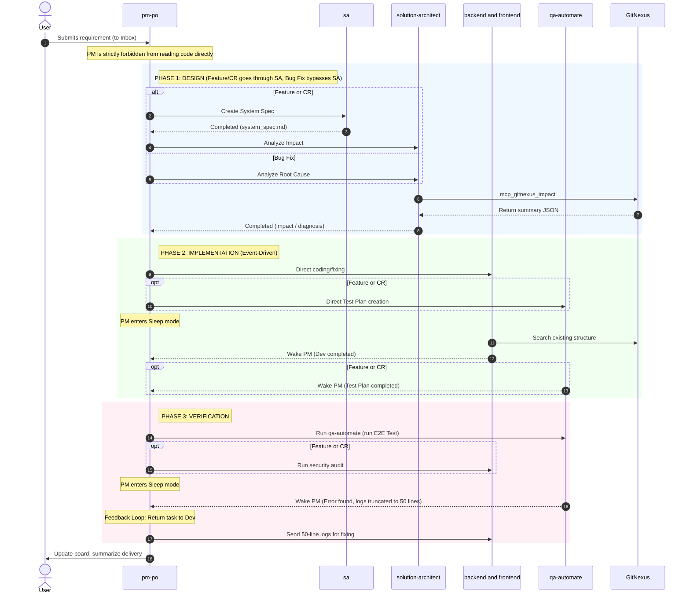

# 🚀 Gemini Agent Team Template

Welcome to the **Gemini Agent Team Template**! 
This project is a template for a virtual software development team (AI Agent Team) powered by an **Event-Driven Orchestration** architecture, coupled with **Token Optimization** design via the intelligent code analysis tool `GitNexus`.

Our Agent team consists of various roles covering the entire development cycle, from requirements gathering, system design, frontend/backend coding, to automated E2E testing.

---

## 🏗️ AgentFlow Architecture

The system is designed to work in a hybrid **Sequential** and **Parallel** manner to maximize development speed and optimize token usage.

### 📊 1. System Overview Flowchart

### ⏱️ 2. Sequence Diagram (Detailed Invocation)

---

## 📝 Step-by-Step Process

**Initiation:**
The user submits a requirement in the chat. The first bot to wake up is **`@pm-po`** (Project Manager). It records the requirement in `inbox_log.md` and runs `init_feature.py --type` to initialize separate folders for each task type (Feature, CR, Bug Fix).

**Phase 1: Design (Design Stage)**
1. For **Features and CRs**: `pm-po` assigns the task to **`@sa` (System Analyst)** to analyze requirements and write `system_spec.md`. Then `@solution-architect` analyzes the impact and records it in `architecture_impact.md`.
2. For **Bug Fixes**: Bypasses the SA spec. `@solution-architect` directly writes the analysis and remediation steps in `bug_diagnosis.md`.

**Phase 2: Implementation (Build Stage)**
1. For **Features and CRs**: `pm-po` triggers **`@backend-dev`** (or frontend) and **`@qa-automate`** in parallel (Developer writes code, QA designs the Test Plan).
2. For **Bug Fixes**: Bypasses the Test Plan. Developers immediately start fixing the code.
3. Once the Backend Developer finishes, the task is handed over to the Frontend Developer to integrate components.

**Phase 3: Verification (Validation Stage)**
1. The `@qa-automate` bot executes the E2E Test suite to check functionality and prevent regression.
2. For **Features and CRs**: `@security` runs a Security Audit (Diff Scan) to check for vulnerabilities.
3. Once both checks pass (Security PASSED + E2E PASSED), the PM archives the feature folder and summarizes the project delivery.

---

## 🎭 Edge Case Simulations

To illustrate real operations, here are mock scenarios and system reactions:

### 🚨 1. Vague User Requirements
- **Scenario:** The user types in the Inbox: *"I want a share button."*
- **Response:** `@pm-po` will trigger its interview skills, pausing execution to ask the user exactly one question at a time. Once the specifications are clear, it forwards them to `@sa`.

### 🚨 2. Frontend Developer Hallucination of APIs
- **Scenario:** `@backend-dev` has not finished implementing the endpoint, but `@frontend-dev` begins writing mock data structure arbitrarily.
- **Response:** The API Contract rule triggers. Frontend bots are forced to read `api_contract.yaml` before writing code. If the contract does not exist yet, the bot waits.

### 🚨 3. Test Failure and Feedback Loop
- **Scenario:** `@qa-automate` runs E2E tests and encounters a 500 error.
- **Response:** The QA bot saves the error log (truncated to 50 lines max) and sends it to `@pm-po`. The PM returns the task to `@backend-dev`. Before editing, the developer must run `mcp_gitnexus_impact` to analyze the blast radius.

### 🚨 4. Endless Bug Fixing Loop (Deadlock Prevention)
- **Scenario:** `@backend-dev` fails to fix a bug and repeatedly runs failing tests.
- **Response:** If the fix fails 3 times consecutively, the bot gives up, marks the lock file status as `failed`, and notifies the human developer to step in. This prevents infinite wait time and token waste.

### 🚨 5. Security Vulnerability Detected
- **Scenario:** `@security` detects a hardcoded secret in the frontend code.
- **Response:** The security bot is prohibited from modifying the code directly (to prevent breaking business logic). Instead, it logs a FAILED report in `security_audit.md` and notifies the PM to return the task to the frontend developer.

---

## 🛠️ How to Use This Repository

### 1. Project Structure
This project coordinates with agent files defined under `.agents/`:
- `.agents/AGENTS.md` - The AI constitution defining rules and constraints (e.g., GitNexus workflow, PM rules).
- `.agents/agents/` - The system prompt profiles for each agent bot.
- `second-brain/` - The Second Brain directory containing specs, code, logs, and lock files. Lock files are placed in `locks/` using atomic file writing to handle parallel task locking securely and avoid merge conflicts.

### 2. Requesting New Features
When you want the AI team to develop a new feature, you don't need to communicate with Devs or QA individually. Simply command the **PM** in the chat:
> *"Please create a JWT Login Authentication system."*

**PM (`@pm-po`)** will automatically wake up, create the second-brain directory structure, update `project_board.md`, and delegate tasks to the appropriate specialist agents.

### 3. Required Integrations (MCP Servers)
To unlock full capabilities, the agents rely on these backend integrations:
- **`GitNexus`**: Used by Librarian, Devs, and Architects to build call graphs and inspect structures while saving tokens.
- **`Playwright`**: Used by QA Automation to test real UI flows in Chromium.

*(These MCP services run automatically via `npx` in the background as requested.)*
