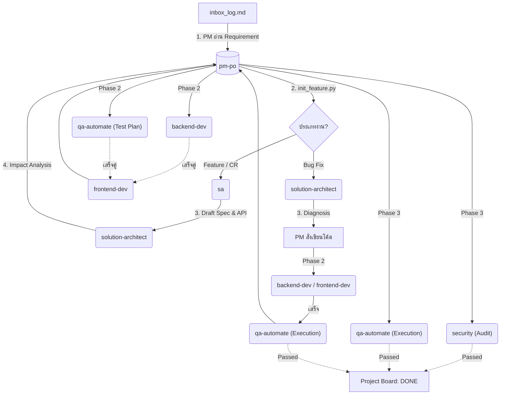
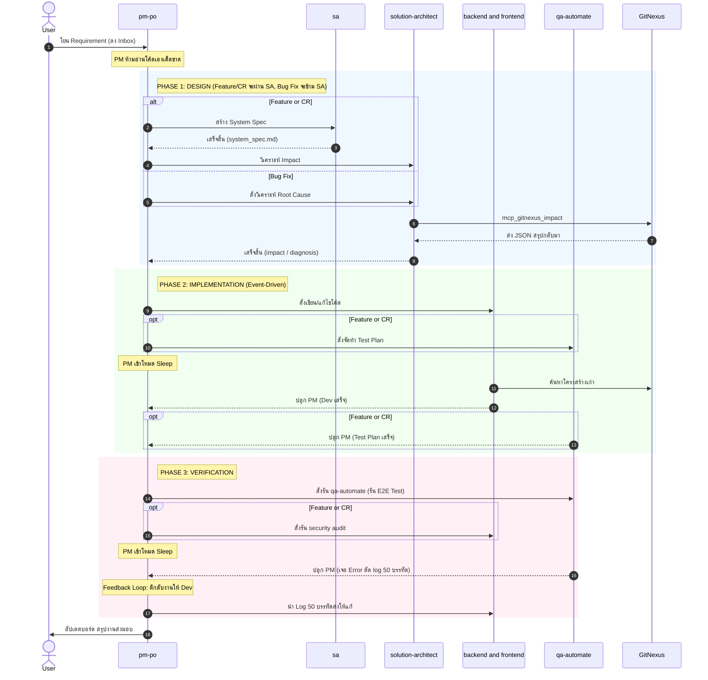

# 🚀 Gemini Agent Team Template

ยินดีต้อนรับสู่โปรเจกต์ **Gemini Agent Team Template**! 
โปรเจกต์นี้คือแม่แบบสำหรับทีมพัฒนาซอฟต์แวร์เสมือนจริง (AI Agent Team) ที่ขับเคลื่อนด้วยสถาปัตยกรรม **Event-Driven Orchestration** ควบคู่ไปกับการออกแบบ **Token Optimization** ผ่านเครื่องมือวิเคราะห์โค้ดอัจฉริยะอย่าง `GitNexus`

ทีม Agent ของเราประกอบไปด้วยบทบาทต่างๆ ที่ครอบคลุมตั้งแต่การเก็บ Requirement, การออกแบบระบบ (System Design), การเขียนโค้ดทั้งหน้าบ้านและหลังบ้าน, ไปจนถึงการเขียนสคริปต์ทดสอบระบบอัตโนมัติ (Automated E2E Testing)

---

## 🏗️ สถาปัตยกรรมของ AgentFlow

ระบบได้ถูกออกแบบให้ทำงานแบบผสมผสานทั้ง **Sequential (ทำทีละขั้น)** และ **Parallel (ทำคู่ขนาน)** เพื่อความรวดเร็วและประหยัด Token

### 📊 1. Flowchart ภาพรวมของระบบ

### ⏱️ 2. Sequence Diagram (เจาะลึกเมื่อสั่งงาน)

---

## 📝 กระบวนการทำงานแบบ Step-by-Step

**จุดเริ่มต้น:**
ผู้ใช้งานโยน Requirement ลงมาในแชท บอทตัวแรกที่ตื่นขึ้นมาคือ **`@pm-po`** (Project Manager) ทำหน้าที่รับ Requirement บันทึกลงใน `inbox_log.md` จากนั้นรัน `init_feature.py --type` เพื่อแยกโฟลเดอร์สำหรับงานแต่ละประเภท (Feature, CR, Bug Fix)

**Phase 1: Design (ขั้นตอนการออกแบบ)**
1. สำหรับ **Feature และ CR**: `pm-po` สั่งงานให้ **`@sa` (System Analyst)** ทำการวิเคราะห์ Requirement และเขียนเอกสาร `system_spec.md` (หรือรุ่นต่อขยาย) จากนั้น `@solution-architect` จะวิเคราะห์ผลกระทบและบันทึกลง `architecture_impact.md`
2. สำหรับ **Bug Fix**: ข้ามการทำ Spec ของ SA โดย `@solution-architect` จะเขียนวิเคราะห์และระบุแนวทางแก้ไขใน `bug_diagnosis.md` ทันที

**Phase 2: Implementation (ขั้นตอนการสร้าง)**
1. สำหรับ **Feature และ CR**: `pm-po` สั่งรัน **`@backend-dev`** (หรือ frontend) และ **`@qa-automate`** ให้จัดทำ Test Plan ควบคู่กันไป
2. สำหรับ **Bug Fix**: ข้ามการทำ Test Plan โดย Developer ลงมือแก้ไขโค้ดที่เสียหายทันที
3. เมื่อ Developer แก้ไขโค้ดเสร็จ จะส่งมอบงานให้ Frontend ต่อจิ๊กซอว์ให้เรียบร้อย

**Phase 3: Verification (ขั้นตอนการตรวจสอบ)**
1. บอท `@qa-automate` รันชุด E2E Test เพื่อตรวจสอบความสมบูรณ์และ Regression
2. สำหรับ **Feature และ CR**: บอท `@security` จะทำ Security Audit (Diff Scan) ตรวจสอบความปลอดภัย
3. เมื่อผลลัพธ์ผ่าน (Security PASSED + E2E PASSED) PM จะย้ายประวัติงานลงในโฟลเดอร์ `archives/` และสรุปส่งมอบโครงการ

---

## 🎭 จำลองเหตุการณ์ที่มีโอกาสเกิดขึ้น (Edge Case Simulations)

เพื่อให้เห็นภาพการทำงานจริง นี่คือสถานการณ์จำลองและปฏิกิริยาของระบบ:

### 🚨 1. ลูกค้าให้ Requirement มาแบบคลุมเครือ
- **สถานการณ์:** ผู้ใช้พิมพ์ใน Inbox แค่ว่า *"อยากได้ปุ่มกดแชร์"*
- **การตอบสนอง:** `@pm-po` จะใช้สกิลสัมภาษณ์เพื่อหยุดการสั่งงานและถามคำถามกับผู้ใช้ทีละ 1 คำถาม จนกว่าสเปกจะชัดเจน จึงจะส่งต่อให้ `@sa`

### 🚨 2. Frontend จินตนาการ API เอง (Hallucination)
- **สถานการณ์:** `@backend-dev` ยังพัฒนาไม่เสร็จ แต่ `@frontend-dev` เริ่มมั่วโครงสร้าง Mock Data ขึ้นมาเอง
- **การตอบสนอง:** กฎ API Contract จะทำงาน บอท Frontend จะถูกบังคับให้อ่าน `api_contract.yaml` ก่อนเขียนโค้ดเสมอ หากไม่มีข้อมูลในนั้น บอทจะหยุดรอ

### 🚨 3. ระบบเทสพังและโดนตีกลับ (The Feedback Loop)
- **สถานการณ์:** บอท `@qa-automate` รัน E2E แล้วพัง (Error 500)
- **การตอบสนอง:** QA จะบันทึก Log ลงในไฟล์แบบตัดทอนไม่เกิน 50 บรรทัด (Log Truncation) แล้วส่งให้ `@pm-po` ตีกลับงานให้ `@backend-dev` ซ่อม โดย Dev ต้องรัน `mcp_gitnexus_impact` วิเคราะห์ผลกระทบก่อนแก้โค้ด

### 🚨 4. นักพัฒนาแก้บั๊กไม่สำเร็จจนติดลูป (Deadlock Prevention)
- **สถานการณ์:** สืบเนื่องจากเหตุการณ์ก่อนหน้า บั๊กแก้ยาก `@backend-dev` พยายามแก้และรันเทสพังซ้ำหลายรอบ
- **การตอบสนอง:** เมื่อล้มเหลวติดต่อกันครบ 3 ครั้ง บอทจะยอมแพ้ เปลี่ยนสถานะล็อกเป็น `failed` แล้วเรียกให้มนุษย์เข้ามาดู เพื่อป้องกันระบบค้าง (Infinite Wait) และป้องกันกิน Token ฟรี

### 🚨 5. ตรวจพบช่องโหว่ความปลอดภัยร้ายแรง
- **สถานการณ์:** `@security` ตรวจพบ Hardcoded Secret ในโค้ด Frontend
- **การตอบสนอง:** บอท Security จะไม่แก้โค้ดเอง (กันตรรกะระบบพัง) แต่มันจะทำรายงานลง `security_audit.md` (สถานะ FAILED) แจ้ง PM ให้ตีกลับงานไปที่ Frontend เพื่อแก้ปัญหา

---

## 🛠️ วิธีการใช้งาน Repository นี้ (How to use)

### 1. โครงสร้างของ Project 
โปรเจกต์นี้ทำงานร่วมกับโครงสร้าง Agent ที่ฝังอยู่ในโฟลเดอร์ `.agents/`:
- `.agents/AGENTS.md` - รัฐธรรมนูญของ AI กำหนดกฎกติกาการทำงานทั้งหมด (เช่น การใช้ GitNexus, กฎของ PM)
- `.agents/agents/` - ไฟล์บุคลิกภาพ (System Prompt) ของบอทแต่ละตัว
- `second-brain/` - โฟลเดอร์สมองที่ 2 สำหรับเก็บเอกสาร สเปก โค้ด และบันทึกสถานะโปรเจกต์ (เก็บล็อกแยกไฟล์รายบอทที่โฟลเดอร์ `locks/` ด้วยตรรกะแบบเขียนไฟล์อะตอมมิกเพื่อความปลอดภัยสูงสุดในการรันขนานและป้องกันความขัดแย้งของโค้ด)

### 2. การเรียกใช้งานฟีเจอร์ใหม่
เมื่อคุณมีไอเดียหรือฟีเจอร์ที่อยากให้ AI ทีมนี้พัฒนา คุณไม่จำเป็นต้องไปคุยกับ Dev หรือ QA ด้วยตัวเอง! ให้คุณพิมพ์คำสั่งในแชทถึง **PM** ได้เลย เช่น:
> *"ช่วยทำระบบ Login Authentication ด้วย JWT ให้หน่อย"*

**PM (`@pm-po`)** จะตื่นขึ้นมา สร้างโฟลเดอร์ใน `second-brain` แจกแจงงานลง `project_board.md` และปลุกบอทตัวอื่นๆ ให้ทำงานตาม Flow ด้านบนให้คุณโดยอัตโนมัติ 

### 3. ส่วนเสริมที่จำเป็น (MCP Servers)
เพื่อให้ Agent ทำงานได้อย่างเต็มประสิทธิภาพ โปรเจกต์นี้จะพึ่งพาเครื่องมือ (Tools) เบื้องหลัง:
- **`GitNexus`**: สำหรับให้ Librarian, Dev, และ Architect สร้าง Call Graph ของโปรเจกต์ ช่วยประหยัด Token การอ่านไฟล์โค้ด
- **`Playwright`**: สำหรับให้ QA Automate เปิดเบราว์เซอร์แล้วคลิกทดสอบหน้าเว็บจริงๆ 

*(ระบบจะรัน MCP พวกนี้ผ่าน `npx` อัตโนมัติในเบื้องหลังตามคิวที่เรียกใช้งาน)*
