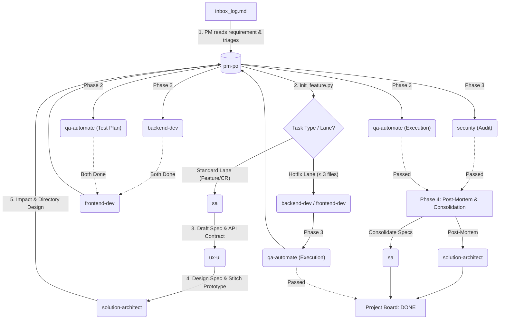
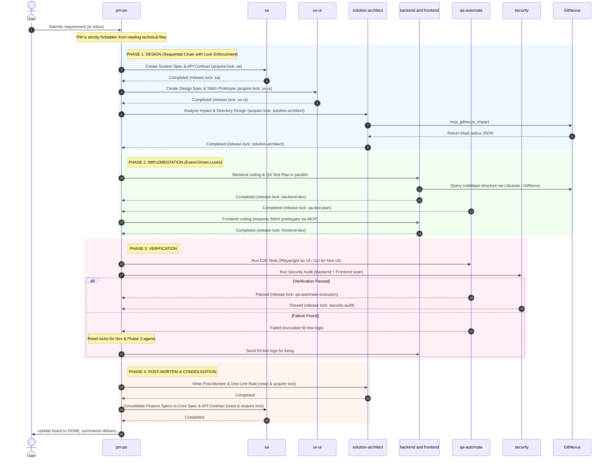

# 🚀 Gemini Agent Team Template

Welcome to the **Gemini Agent Team Template**! 
This project is a template for a virtual software development team (AI Agent Team) powered by an **Event-Driven Orchestration** architecture, coupled with **Token Optimization** design via the intelligent code analysis tool `GitNexus`.

Our Agent team consists of various roles covering the entire development cycle, from requirements gathering, system design, frontend/backend coding, to automated E2E testing.

---

## 🏗️ AgentFlow Architecture

The system is designed to work in a hybrid **Sequential** and **Parallel** manner to maximize development speed and optimize token usage.

### 📊 1. System Overview Flowchart

### ⏱️ 2. Sequence Diagram (Detailed Invocation)

---

## 📝 Step-by-Step Process

**Initiation:**
The user submits a requirement in the chat. The first bot to wake up is **`@pm-po`** (Project Manager). It records the requirement in `inbox_log.md` and evaluates the task scope:
- **Standard Lane** (Features/CRs/Bugs): Evaluates requirements, then initializes directories using `init_feature.py --type` and proceeds sequentially through Phase 1-4.
- **Hotfix Lane** (Trivial changes ≤ 3 files with no new endpoints/routes/tables): Initializes directories with `init_feature.py --skip-agents sa,ux-ui,solution-architect`, delegating directly to Dev → QA.

**Phase 1: Design (Design Stage — Sequential Chain)**
1. **System Specification**: `pm-po` assigns the task to **`@sa` (System Analyst)** (acquires `sa` lock) to analyze requirements and write `system_spec.md` and `api_contract.yaml`.
2. **Visual Prototyping & Design Spec**: Next, **`@ux-ui` (UX/UI Designer)** (acquires `ux-ui` lock after `sa` completes) creates `DESIGN.md`, generates visual prototypes using Google Stitch MCP, and documents `design_spec.md` covering wireframes, component specs, design tokens, and user flow diagrams.
3. **Architecture Impact**: Then **`@solution-architect`** (acquires `solution-architect` lock after `ux-ui` completes) analyzes system impact (Blast Radius), designs proposed directory/file structures, and records them in `architecture_impact.md`.

**Phase 2: Implementation (Build Stage)**
1. **Backend & Test Plan (Parallel)**: `pm-po` triggers **`@backend-dev`** (acquires `backend-dev` lock after `solution-architect` completes) and **`@qa-automate`** (acquires `qa-test-plan` lock) in parallel.
2. **Frontend Implementation**: Once Backend and Test Plan finish, `pm-po` triggers **`@frontend-dev`** (acquires `frontend-dev` lock). `@frontend-dev` inspects Stitch visual prototypes via Stitch MCP (`get_screen`) and connects to endpoints defined in `api_contract.yaml`.

**Phase 3: Verification (Validation Stage)**
1. **Automated Testing**: **`@qa-automate`** (acquires `qa-automate-execution` lock) executes automated tests based on its Decision Rule (Playwright MCP for UI tasks / CLI runners for Non-UI tasks).
2. **Security Audit**: **`@security`** (acquires `security-audit` lock) runs a full audit scanning both Backend and Frontend code for vulnerabilities, hardcoded secrets, and XSS.
3. **Defect Loop**: If failures occur, PM resets locks for Dev and Phase 3 agents, sending truncated 50-line logs back to Devs for fixing.

**Phase 4: Post-Mortem & Consolidation (Reflect & Merge Stage)**
1. **Post-Mortem**: `@pm-po` resets Phase 4 locks and commands **`@solution-architect`** to write a Post-Mortem report and extract a One-Line Rule into `lessons_learned.md`.
2. **Spec Consolidation**: **`@sa`** merges feature endpoints, schemas, and specs from `features/<slug>/` into core `second-brain/03-requirements-spec/system_spec.md` and `api_contract.yaml` (preserving PM's Blind Orchestrator constraint).

---

## 🎭 Edge Case Simulations

To illustrate real operations, here are mock scenarios and system reactions:

### 🚨 1. Vague User Requirements
- **Scenario:** The user types in the Inbox: *"I want a share button."*
- **Response:** `@pm-po` will trigger its interview skills, pausing execution to ask the user exactly one question at a time. Once the specifications are clear, it forwards them to `@sa`.

### 🚨 2. Frontend Developer Hallucination of APIs
- **Scenario:** `@backend-dev` has not finished implementing the endpoint, but `@frontend-dev` begins writing mock data structure arbitrarily.
- **Response:** The API Contract rule triggers. Frontend bots are forced to read `api_contract.yaml` before writing code. If the contract does not exist yet, the bot waits.

### 🚨 3. Test Failure and Feedback Loop
- **Scenario:** `@qa-automate` runs E2E tests and encounters a 500 error.
- **Response:** The QA bot saves the error log (truncated to 50 lines max) and sends it to `@pm-po`. The PM returns the task to `@backend-dev`. Before editing, the developer must run `mcp_gitnexus_impact` to analyze the blast radius.

### 🚨 4. Endless Bug Fixing Loop (Deadlock Prevention)
- **Scenario:** `@backend-dev` fails to fix a bug and repeatedly runs failing tests.
- **Response:** If the fix fails 3 times consecutively, the bot gives up, marks the lock file status as `failed`, and notifies the human developer to step in. This prevents infinite wait time and token waste.

### 🚨 5. Security Vulnerability Detected
- **Scenario:** `@security` detects a hardcoded secret in the frontend code.
- **Response:** The security bot is prohibited from modifying the code directly (to prevent breaking business logic). Instead, it logs a FAILED report in `security_audit.md` and notifies the PM to return the task to the frontend developer.

---

## 🛠️ How to Use This Repository

### 1. Project Structure
This project coordinates with agent files defined under `.agents/`:
- `.agents/AGENTS.md` - The AI constitution defining rules and constraints (e.g., GitNexus workflow, PM rules).
- `.agents/agents/` - The system prompt profiles for each agent bot.
- `second-brain/` - The Second Brain directory containing specs, code, logs, and lock files (11 sequential directories: `01-inbox` to `11-diary`). Lock files are placed in `locks/` using atomic file writing to handle parallel task locking securely and avoid merge conflicts.

### 2. Requesting New Features
When you want the AI team to develop a new feature, you don't need to communicate with Devs or QA individually. Simply command the **PM** in the chat:
> *"Please create a JWT Login Authentication system."*

**PM (`@pm-po`)** will automatically wake up, create the second-brain directory structure, update `project_board.md`, and delegate tasks to the appropriate specialist agents.

### 3. Required Integrations (MCP Servers)
To unlock full capabilities, the agents rely on these backend integrations:
- **`GitNexus`**: Used by Librarian, Devs, and Architects to build call graphs and inspect structures while saving tokens.
- **`Playwright`**: Used by QA Automation (`@qa-automate`) for browser-based UI testing.
- **`Stitch`**: Used by UX/UI Designer (`@ux-ui`) to generate Design Systems and Visual Prototypes from text prompts. Frontend Developer (`@frontend-dev`) has read-only access to inspect screen details.

*(These MCP services run automatically via `npx` in the background as requested.)*

---

## 🛡️ System-Wide Quality & Safety Gates (Automated Lock Enforcement)

To prevent AI hallucination, shortcutting, or silent fallback (YOLO mode), the workspace enforces **7 Automated Quality Gates** at the script level (`lock_manager.py` and `brain_linter.py`):

| Agent Role | Gate Name | Automated Validation Rules (`lock_manager.py` & `brain_linter.py`) |
| :--- | :--- | :--- |
| **`@ux-ui`** | **Stitch Gate** | `design_spec.md` MUST contain a valid `Stitch Project ID` generated via Google Stitch MCP. Placeholder IDs or text-only fallbacks are automatically blocked upon lock release. |
| **`@qa-automate`** | **Playwright Gate** | For UI tasks (`design_spec.md` exists), `test_execution.md` MUST contain evidence of Playwright MCP browser E2E test execution. CLI unit test substitution is blocked. |
| **`@security`** | **Security Status Gate** | `security_audit.md` MUST contain an explicit `[STATUS: PASSED]` or `[STATUS: FAILED]` header. |
| **`@solution-architect`** | **Architect Impact Gate** | `architecture_impact.md` MUST contain a non-empty Blast Radius / Symbol Impact Analysis section powered by GitNexus. |
| **`@sa`** | **SA Spec & Contract Gate** | Both `system_spec.md` AND `api_contract.yaml` MUST exist, with `api_contract.yaml` passing strict YAML syntax parsing. |
| **`@backend-dev` & `@frontend-dev`** | **Dev Changelog Gate** | Lock release is automatically blocked unless a corresponding changelog entry is written in `second-brain/10-archives/changelog/`. Devs must also verify Blast Radius via `@nexus-librarian` before editing existing code. |
| **`@nexus-librarian`** | **Information Provider Gate** | MUST format all file locations as workspace-relative paths (never absolute system paths) and auto-trigger `npx gitnexus analyze` if the index becomes stale. |

