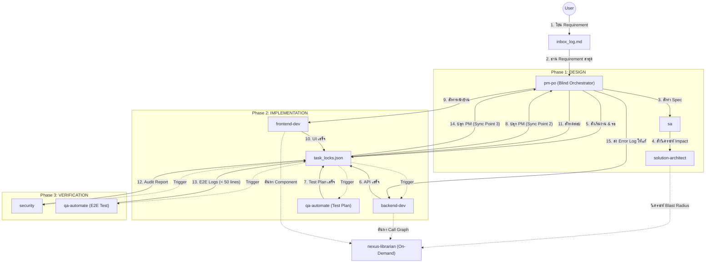
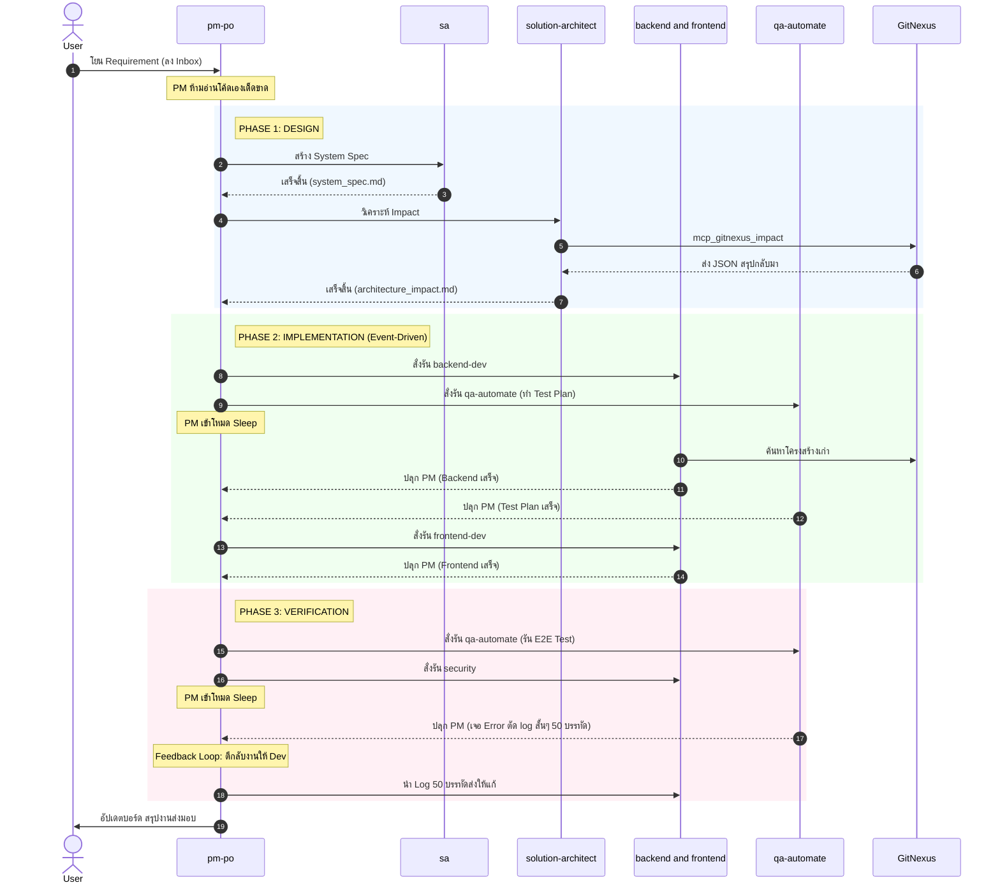

# 🚀 Gemini Agent Team Template

ยินดีต้อนรับสู่โปรเจกต์ **Gemini Agent Team Template**! 
โปรเจกต์นี้คือแม่แบบสำหรับทีมพัฒนาซอฟต์แวร์เสมือนจริง (AI Agent Team) ที่ขับเคลื่อนด้วยสถาปัตยกรรม **Event-Driven Orchestration** ควบคู่ไปกับการออกแบบ **Token Optimization** ผ่านเครื่องมือวิเคราะห์โค้ดอัจฉริยะอย่าง `GitNexus`

ทีม Agent ของเราประกอบไปด้วยบทบาทต่างๆ ที่ครอบคลุมตั้งแต่การเก็บ Requirement, การออกแบบระบบ (System Design), การเขียนโค้ดทั้งหน้าบ้านและหลังบ้าน, ไปจนถึงการเขียนสคริปต์ทดสอบระบบอัตโนมัติ (Automated E2E Testing)

---

## 🏗️ สถาปัตยกรรมของ AgentFlow

ระบบได้ถูกออกแบบให้ทำงานแบบผสมผสานทั้ง **Sequential (ทำทีละขั้น)** และ **Parallel (ทำคู่ขนาน)** เพื่อความรวดเร็วและประหยัด Token

### 📊 1. Flowchart ภาพรวมของระบบ

### ⏱️ 2. Sequence Diagram (เจาะลึกเมื่อสั่งงาน)

---

## 📝 กระบวนการทำงานแบบ Step-by-Step

**จุดเริ่มต้น:**
ผู้ใช้งานโยน Requirement ลงมาในแชท บอทตัวแรกที่ตื่นขึ้นมาคือ **`@pm-po`** (Project Manager) ทำหน้าที่รับ Requirement บันทึกลงใน `inbox_log.md` 

**Phase 1: Design (ขั้นตอนการออกแบบ)**
1. `pm-po` สั่งงานให้ **`@sa` (System Analyst)** ทำการวิเคราะห์ Requirement และเขียนเอกสาร `system_spec.md` และ `api_contract.yaml`
2. `pm-po` ส่งไม้ต่อให้ **`@solution-architect`** ตรวจสอบผลกระทบกับโครงสร้างเดิม (Blast Radius) โดยอาศัยเครื่องมือ `GitNexus` เพื่อไม่ต้องดึงโค้ดทั้งหมดมาอ่านให้เปลือง Token

**Phase 2: Implementation (ขั้นตอนการสร้าง)**
1. `pm-po` สั่งรัน **`@backend-dev`** และ **`@qa-automate`** ให้ทำงานพร้อมกัน 
2. **`@backend-dev`** พัฒนา API และฐานข้อมูล ส่วน **`@qa-automate`** จะสร้าง `test_plan.md` ล่วงหน้า (Shift-Left Testing)
3. ระหว่างนี้ `pm-po` จะ "หลับ" เพื่อหยุดกิน Token จนกว่าบอททั้ง 2 ตัวจะทำงานเสร็จ (อัปเดตไฟล์ `task_locks.json` สำเร็จ)
4. เมื่อตื่นขึ้นมา `pm-po` จะสั่งรัน **`@frontend-dev`** ให้นำ API ไปต่อเข้ากับ User Interface

**Phase 3: Verification (ขั้นตอนการตรวจสอบ)**
1. เมื่อ Frontend เสร็จ `pm-po` จะสั่งรัน **`@security`** ตรวจสอบช่องโหว่ความปลอดภัย และ **`@qa-automate`** รัน E2E Test บนเบราว์เซอร์จริงด้วย `Playwright MCP`
2. หากทดสอบไม่ผ่าน (มีบั๊ก) QA จะส่ง Error Log สั้นๆ ตัดมาไม่เกิน 50 บรรทัด (Log Truncation) เพื่อประหยัด Token และให้ `pm-po` ตีกลับไปให้ Dev แก้ไข
3. เมื่อทุกอย่างผ่านฉลุย `pm-po` จะแจ้งเตือนผู้ใช้ว่าฟีเจอร์เสร็จสมบูรณ์

---

## 🛠️ วิธีการใช้งาน Repository นี้ (How to use)

### 1. โครงสร้างของ Project 
โปรเจกต์นี้ทำงานร่วมกับโครงสร้าง Agent ที่ฝังอยู่ในโฟลเดอร์ `.agents/`:
- `.agents/AGENTS.md` - รัฐธรรมนูญของ AI กำหนดกฎกติกาการทำงานทั้งหมด (เช่น การใช้ GitNexus, กฎของ PM)
- `.agents/agents/` - ไฟล์บุคลิกภาพ (System Prompt) ของบอทแต่ละตัว
- `second-brain/` - โฟลเดอร์สมองที่ 2 สำหรับเก็บเอกสาร สเปก โค้ด และบันทึกสถานะโปรเจกต์ (`task_locks.json`)

### 2. การเรียกใช้งานฟีเจอร์ใหม่
เมื่อคุณมีไอเดียหรือฟีเจอร์ที่อยากให้ AI ทีมนี้พัฒนา คุณไม่จำเป็นต้องไปคุยกับ Dev หรือ QA ด้วยตัวเอง! ให้คุณพิมพ์คำสั่งในแชทถึง **PM** ได้เลย เช่น:
> *"ช่วยทำระบบ Login Authentication ด้วย JWT ให้หน่อย"*

**PM (`@pm-po`)** จะตื่นขึ้นมา สร้างโฟลเดอร์ใน `second-brain` แจกแจงงานลง `project_board.md` และปลุกบอทตัวอื่นๆ ให้ทำงานตาม Flow ด้านบนให้คุณโดยอัตโนมัติ 

### 3. ส่วนเสริมที่จำเป็น (MCP Servers)
เพื่อให้ Agent ทำงานได้อย่างเต็มประสิทธิภาพ โปรเจกต์นี้จะพึ่งพาเครื่องมือ (Tools) เบื้องหลัง:
- **`GitNexus`**: สำหรับให้ Librarian, Dev, และ Architect สร้าง Call Graph ของโปรเจกต์ ช่วยประหยัด Token การอ่านไฟล์โค้ด
- **`Playwright`**: สำหรับให้ QA Automate เปิดเบราว์เซอร์แล้วคลิกทดสอบหน้าเว็บจริงๆ 

*(ระบบจะรัน MCP พวกนี้ผ่าน `npx` อัตโนมัติในเบื้องหลังตามคิวที่เรียกใช้งาน)*
