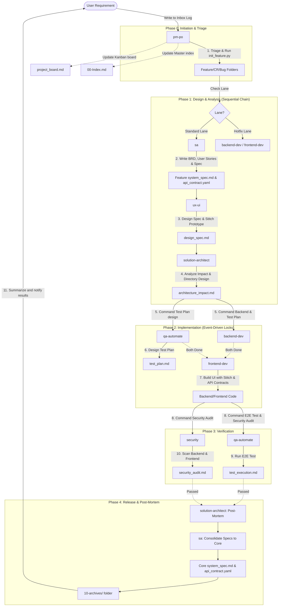

# 🧠 AISDLC Second Brain (Knowledge Base & Project Documentation)

Welcome to the **AISDLC Second Brain**, the central hub for gathering, analyzing, and managing all information in this project through the AI Software Development Life Cycle (AISDLC).

---

## 📁 Directory Structure

This folder is designed to support structured and systematic document storage as follows:

### [📥 01-inbox](01-inbox/)

- **Goal**: Record raw requirements, meeting notes, client briefs, or initial ideation for development.

### [🧠 02-knowledge-base](02-knowledge-base/)

- **Goal**: Accumulated knowledge base, lessons learned, and anti-patterns to avoid.

### [📝 03-requirements-spec](03-requirements-spec/)

- **Goal**: A repository for business requirements and system design specifications, divided into Core (central system) and individual feature/CR documents:
  - `system_spec.md` (Core System Specification): **The core system specification document serving as the Single Source of Truth** (consolidating all current system APIs and DB Schemas, merged by `@sa` in Phase 4).
  - `features/<feature-id-slug>/`: Dedicated folders for each feature or CR to store the development artifacts for that cycle:
    - `brd.md` (Business Requirement Document): Created by `@sa` to define goals, scope, and target users.
    - `epics_user_stories.md` (Epics, User Stories & Acceptance Criteria): Created by `@sa` to break down features into user stories with AC (Given-When-Then format).
    - `system_spec.md` (Feature System Specification): Created by `@sa` to describe technical specs specific to this feature.
    - `design_spec.md` (Design Specification): Created by `@ux-ui` to define wireframe descriptions, UI component specs, design tokens, and user flows, using Stitch MCP for visual prototyping (with `DESIGN.md`).
- **Key Documents**: Core `system_spec.md`, `api_contract.yaml`, and feature-specific folders under `features/`.

### [📐 04-architecture](04-architecture/)

- **Goal**: System architecture analysis and impact assessment (Blast Radius Analysis):
  - `features/<feature-id-slug>/architecture_impact.md`: Created by `@solution-architect` using GitNexus to outline affected files and design API boundaries/contracts.
- **Key Documents**: Feature-specific folders under `features/`.

### [💻 05-development](05-development/)

- **Goal**: Coding guidelines and architectural standards for the project, plus 8 decentralized task locks under `locks/` (`sa`, `ux-ui`, `solution-architect`, `backend-dev`, `frontend-dev`, `qa-test-plan`, `security-audit`, `qa-automate-execution`).
- **Key Documents**: `dev-guidelines.md` and feature `locks/` folders.

### [🛡️ 06-security](06-security/)

- **Goal**: Security audits and vulnerability scans (OWASP Top 10, XSS, Hardcoded Secrets):
  - `features/<feature-id-slug>/security_audit.md`: Created by `@security` scanning both backend and frontend code to outline scan findings and remediation steps.
- **Key Documents**: Feature-specific folders under `features/`.

### [🧪 07-qa-testing](07-qa-testing/)

- **Goal**: E2E quality assurance test planning and executions:
  - `features/<feature-id-slug>/test_plan.md`: Test plan designed by `@qa-automate`.
  - `features/<feature-id-slug>/test_execution.md`: Real execution logs recorded by `@qa-automate` (using Playwright MCP for UI tasks or CLI runners for non-UI tasks based on Decision Rule).
- **Key Documents**: Feature-specific folders under `features/`.

### [🚀 08-delivery-ops](08-delivery-ops/)

- **Goal**: Deployment playbooks, environments details, release notes summaries, and incident reports (`postmortem/` reports created by `@solution-architect` in Phase 4).

### [📚 09-resources](09-resources/)

- **Goal**: General manuals, cheat sheets, links to external docs, and shared knowledge bases.

### [🗄️ 10-archives](10-archives/)

- **Goal**: History of completed feature tasks and old changelogs (`YYYY-MM-DD-<slug>-<agent>.md`).

### [📓 11-diary](11-diary/)

- **Goal**: Daily work logs recorded by AI agents (`YYYY-MM-DD-<slug>-<agent>.md`).

---

## 🔄 AISDLC Workflow (Flat PM Architecture - Strategy B)



This documentation acts as the project's "Second Brain", ensuring all AI agents in the development loop access consistent, up-to-date information, delivering high-standard and secure software.

---

## 🚀 How to Use the AISDLC Workflow for Developers (Human-AI Collaboration)

In this Multi-Agent system, the human developer's role is to provide initial inputs and verify outcomes:

### 1. Submitting Initial Requirements

To request a new feature or report a bug, append your requirements to the **very top (Top-append)** of [inbox_log.md](file://second-brain/01-inbox/inbox_log.md) following the template format:

- Date (YYYY-MM-DD)
- Type (Feature / Hotfix / CR / Bug)
- Detailed Requirements
- Initial Status: `Pending`

### 2. Triggering the PM-PO Agent

Invoke the `@pm-po` agent via CLI or your IDE. It will read `inbox_log.md` and orchestrate the specialist agents through each phase automatically.

### 3. Collaborating in the Loop

- **When Spec/Impact completes (Phase 1)**: Review `system_spec.md` and `architecture_impact.md` to ensure the AI's technical specifications match your expectations.
- **When Loop Protection triggers (Phase 2 & 3)**: If the security scan fails or E2E tests fail repeatedly more than twice, the PM-PO agent will pause execution and report back in the chat. You can review the logs, adjust the code, or revise specifications to unblock the flow.

---

## 💡 Creating Project-Specific Custom Skills

If you want to add custom coding guidelines or standards for agents to follow:

1. Create a new skill folder under [.agents/skills/](file://../.agents/skills/) (e.g., `my-project-coding-standard`).
2. Create a `SKILL.md` inside it with a YAML Frontmatter:
   ```yaml
   ---
   name: my-project-coding-standard
   description: Project-specific coding standards and guidelines for this service
   ---
   ```
3. Document your guidelines in Markdown inside that file.
4. Add the skill name to the `skills:` list in the corresponding agent files under [.agents/agents/](file://../.agents/agents/) (e.g., `backend-dev.md` or `frontend-dev.md`).

---

## 🧠 Karpathy's Second Brain Concepts in this Project

We adapted **Andrej Karpathy's** personal knowledge management principles to optimize team communication and documentation:

### 1. Append-and-Review (Frictionless Daily Logs)

- **Execution**: All raw requirements are recorded in `[[inbox_log]]`.
- **Gravity Rule**: New logs are appended at the top; older items sink to the bottom. Developers pull active entries into specific specs as needed, avoiding cognitive bloat and outdated noise.

### 2. LLM Wiki (AI-managed Wiki Network)

- **Execution**: AI agents use **Obsidian Wikilinks (`[[Filename#Section]]`)** to link documents across directories. This maintains an interconnected, dynamically linked knowledge graph.

### 3. Health Checks & Automated Gate Enforcement (Data Integrity Scanning)

- **Execution**: We use [brain_linter.py](file://../scripts/brain_linter.py) and [lock_manager.py](file://../scripts/lock_manager.py) to enforce 12 automated health checks and strict lock release gates:
  - Command: `python3 scripts/brain_linter.py`
  - **Comprehensive Verification Categories**:
    1. Second Brain Wikilinks Integrity (`[[wikilinks]]`)
    2. YAML Frontmatter & Tags (`doc/*`, `phase/*`)
    3. Secrets & Credentials Leak Scan
    4. Absolute System Paths Scan (relative path enforcement)
    5. Orphan Files Detection
    6. Critical Files & Templates Integrity
    7. Strategy B Active Feature Folders Completeness
    8. Spec Structures & Heading Hierarchies
    9. **Stitch Design Spec Integrity**: Verifies valid `Stitch Project ID` references in `design_spec.md`.
    10. **Playwright E2E Integrity**: Verifies Playwright MCP browser execution evidence in `test_execution.md` for UI tasks.
    11. **Security Audit Integrity**: Verifies explicit `[STATUS: PASSED]` or `[STATUS: FAILED]` headers in `security_audit.md`.
    12. **Architecture Impact Integrity**: Verifies GitNexus Blast Radius analysis in `architecture_impact.md`.
