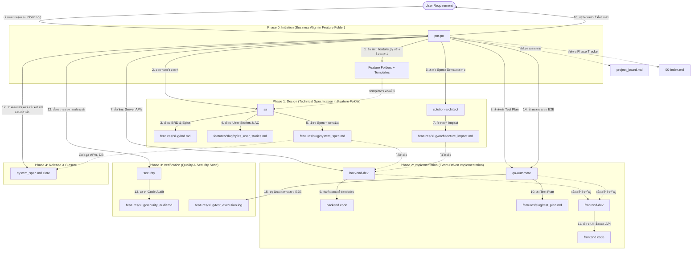

# 🧠 AISDLC Second Brain (คลังความรู้และเอกสารโครงการ)

ยินดีต้อนรับสู่ **AISDLC Second Brain** ซึ่งเป็นศูนย์กลางในการรวบรวม วิเคราะห์ และจัดการข้อมูลทั้งหมดในโครงการนี้ผ่านวงจรการพัฒนาซอฟต์แวร์โดย AI (AI Software Development Life Cycle - AISDLC)

---

## 📁 โครงสร้างโฟลเดอร์ (Directory Structure)

โฟลเดอร์นี้ถูกออกแบบมาเพื่อรองรับการจัดเก็บเอกสารอย่างเป็นขั้นตอนและมีแบบแผนที่ชัดเจน ดังนี้:

### [📥 00-inbox](00-inbox/)

- **เป้าหมาย**: บันทึกความต้องการดิบ (Raw Requirements), บันทึกการประชุม (Meeting Notes), รายละเอียดบรีฟจากลูกค้า หรือไอเดียเริ่มต้นสำหรับการพัฒนา

### [📝 10-requirements-spec](10-requirements-spec/)

- **เป้าหมาย**: คลังเอกสารข้อกำหนดความต้องการทางธุรกิจและการออกแบบระบบ โดยมีทั้งแกนกลางหลัก (Core) และแยกย่อยรายฟีเจอร์/CR:
  - `system_spec.md` (Core System Specification): **เอกสารสเปกระบบหลักที่เป็นแกนกลางและ Single Source of Truth** (รวบรวมข้อมูล API และ DB Schema ทั้งหมดของระบบในปัจจุบัน)
  - `features/<feature-id-slug>/`: โฟลเดอร์เฉพาะสำหรับฟีเจอร์หรือ CR แต่ละตัว เก็บเอกสารการพัฒนาในรอบนั้น ๆ:
    - `brd.md` (Business Requirement Document): จัดทำโดย `@pm-po` เพื่อระบุเป้าหมาย ขอบเขต และผู้ใช้งานของฟีเจอร์นี้
    - `epics_user_stories.md` (Epics, User Stories & Acceptance Criteria): จัดทำโดย `@pm-po` ในการแตกฟีเจอร์เป็นหน่วยย่อยพร้อม AC (Given-When-Then)
    - `system_spec.md` (Feature System Specification): จัดทำโดย `@sa` เพื่ออธิบายสเปกทางเทคนิคเฉพาะของฟีเจอร์นี้
- **เอกสารหลัก**: `system_spec.md` และโฟลเดอร์ใน `features/`

### [📐 20-architecture](20-architecture/)

- **เป้าหมาย**: การวิเคราะห์โครงสร้างสถาปัตยกรรมระบบและการวิเคราะห์ผลกระทบเมื่อมีการแก้ไขโค้ด (Blast Radius Analysis):
  - `features/<feature-id-slug>/architecture_impact.md`: จัดทำโดย `@solution-architect` เพื่อแสดงไฟล์ที่ได้รับผลกระทบและการออกแบบ API Boundaries
- **เอกสารหลัก**: โฟลเดอร์ใน `features/`

### [💻 30-development](30-development/)

- **เป้าหมาย**: แนวทางการเขียนโค้ดและมาตรฐานสถาปัตยกรรมของโครงการ
- **เอกสารหลัก**: `dev-guidelines.md`

### [🛡️ 40-security](40-security/)

- **เป้าหมาย**: การประเมินความปลอดภัยและสแกนช่องโหว่ (OWASP Top 10):
  - `features/<feature-id-slug>/security_audit.md`: จัดทำโดย `@security` เพื่อแสดงผลการสแกนช่องโหว่และวิธีการแก้ไข (Remediation Steps)
- **เอกสารหลัก**: โฟลเดอร์ใน `features/`

### [🧪 50-qa-testing](50-qa-testing/)

- **เป้าหมาย**: แผนและการทดสอบคุณภาพระบบระดับ E2E:
  - `features/<feature-id-slug>/test_plan.md`: แผนการทดสอบที่ออกแบบโดย `@qa-automate`
  - `features/<feature-id-slug>/test_execution.log`: บันทึกผลการรันทดสอบจริงโดย `@qa-automate`
- **เอกสารหลัก**: โฟลเดอร์ใน `features/`

### [🚀 60-delivery-ops](60-delivery-ops/)

- **เป้าหมาย**: รายละเอียดการเตรียมระบบสำหรับการนำส่ง (Deployment Playbooks), ข้อมูลการ Deploy, สรุปประวัติการอัปเดต (Release Notes) และรายงานวิเคราะห์หลังเกิดเหตุ (Post-Mortem Reports)

### [📚 70-resources](70-resources/)

- **เป้าหมาย**: คู่มือการใช้งานระบบทั่วไป, Cheat Sheets, ลิงก์เอกสารภายนอก และความรู้ที่ใช้ร่วมกันในโครงการ

---

## 🔄 แผนผังการทำงาน AISDLC (Flat PM Architecture - Strategy B)



ระบบเอกสารนี้เป็น "สมองส่วนที่สอง" ที่ช่วยให้มั่นใจได้ว่า AI Agents ทุกตัวที่ทำงานในลูปสามารถเข้าถึงข้อมูลที่ตรงกัน อัปเดตล่าสุด และส่งมอบงานได้อย่างมีมาตรฐานสูงและปลอดภัย

---

## 🚀 วิธีการใช้งานกระบวนการ AISDLC สำหรับ Developer (Human-AI Collaboration)

ในการทำงานร่วมกับระบบ Multi-Agent นี้ นักพัฒนา (มนุษย์) มีบทบาทในการป้อนข้อมูลเริ่มต้นและตรวจสอบความถูกต้องดังนี้:

### 1. การส่ง Requirement เริ่มต้น

เมื่อต้องการเพิ่มฟีเจอร์ใหม่ หรือแก้ไขบั๊ก ให้พิมพ์ความต้องการนั้นต่อที่ **ด้านบนสุด (Top-append)** ของไฟล์ [inbox_log.md](file://second-brain/00-inbox/inbox_log.md) โดยอ้างอิงเทมเพลตและระบุรายละเอียด:

- วันที่ (YYYY-MM-DD)
- ประเภท (Feature / Hotfix / Task)
- รายละเอียดความต้องการ
- สถานะเริ่มต้น: `Pending`

### 2. การสั่งงาน PM-PO Agent

เรียกใช้ Agent `@pm-po` ผ่าน CLI หรือ IDE เพื่อให้เข้ามาอ่าน `inbox_log.md` และเริ่มต้นสั่งการ Specialist Agents ในแต่ละเฟสโดยอัตโนมัติ

### 3. การประสานงานระหว่างรันลูป

- **เมื่อ Spec/Impact เสร็จ (Phase 1)**: เข้าไปตรวจสอบความถูกต้องที่ `system_spec.md` และ `architecture_impact.md` เพื่อให้แน่ใจว่า AI เข้าใจงานตรงกัน
- **เมื่อเกิดเหตุการณ์ Loop Protection (Phase 2 & 3)**: หากเกิดกรณีที่บอท Security ตรวจสอบไม่ผ่าน หรือ QA รัน E2E แล้วล้มเหลวซ้ำเกิน 2 รอบ PM-PO จะหยุดทำงานอัตโนมัติและรายงานปัญหาให้คุณทราบผ่านห้องแชท ให้ตรวจสอบและช่วยปรับปรุงโค้ดหรือแก้ไขสเปกในขั้นตอนนี้

---

## 💡 การสร้าง Custom Skills เฉพาะโปรเจกต์

หากคุณต้องการเพิ่มเติมทักษะหรือสร้าง Coding Standard เฉพาะโปรเจกต์เพื่อให้ Agents ปฏิบัติตาม:

1. สร้างโฟลเดอร์ทักษะใหม่ภายใต้โฟลเดอร์ [.agents/skills/](file://../.agents/skills/) (เช่น `my-project-coding-standard`)
2. สร้างไฟล์ `SKILL.md` ข้างในและกำหนดหัวไฟล์ (YAML Frontmatter) เช่น:
   ```yaml
   ---
   name: my-project-coding-standard
   description: มาตรฐานการเขียนโค้ดและโครงสร้างโปรเจกต์เฉพาะสำหรับบริการนี้
   ---
   ```
3. เขียนเนื้อหาและแนวทางที่ต้องการลงในบอท
4. นำชื่อสกิลไปผูกไว้ในส่วน `skills:` ของไฟล์ Agent ที่เกี่ยวข้องในโฟลเดอร์ [.gemini/agents/](file://../.gemini/agents/) (เช่น `backend-dev.md` หรือ `frontend-dev.md`)

---

## 🧠 แนวคิด Karpathy's Second Brain ในโปรเจกต์นี้

เราได้นำแนวคิดในการสร้างพื้นที่เก็บข้อมูลส่วนตัวของ **Andrej Karpathy** มาปรับใช้เพื่อพัฒนาประสิทธิภาพของทีมและคุณภาพความรู้ดังนี้:

### 1. Append-and-Review (บันทึกรายวันไร้แรงต้าน)

- **การใช้งาน**: บันทึกความต้องการดิบทั้งหมดถูกใส่ไว้ใน `[[inbox_log]]`
- **กฎแรงโน้มถ่วง (Gravity)**: ข้อมูลใหม่จะต่ออยู่ด้านบนสุด ข้อมูลเก่าจะจมลงล่าง ทีมงานจะดึงเฉพาะข้อมูลสำคัญไปสร้างหัวข้อสเปก ทำให้ไม่เจอปัญหาข้อมูลเยอะจนสมองล้า (Cognitive Bloat)

### 2. LLM Wiki (การจัดโครงข่ายวิกิด้วย AI)

- **การใช้งาน**: AI Agents จะไม่ทำงานแยกเอกสารขาดจากกัน แต่จะเขียนอ้างอิงเอกสารและหัวข้ออื่นๆ ข้ามโฟลเดอร์โดยใช้ **Obsidian Wikilinks (`[[ชื่อไฟล์#หัวข้อ]]`)** ทำให้คลังความรู้เชื่อมโยงกันเป็นกราฟแบบไดนามิก

### 3. Health Checks & Linting (ระบบสแกนสุขภาพข้อมูล)

- **การใช้งาน**: เราใช้สคริปต์ [brain_linter.py](file://../scripts/brain_linter.py) เพื่อคอยตรวจสอบโครงสร้างของคลังข้อมูล:
  - รันคำสั่ง: `python3 scripts/brain_linter.py`
  - มันจะตรวจหา **ลิงก์เสีย (Broken Links)** หรือ **หัวข้อที่อ้างอิงไม่เจอ** เพื่อประกันความถูกต้องของสมอง AI ตลอดกระบวนการ AISDLC
